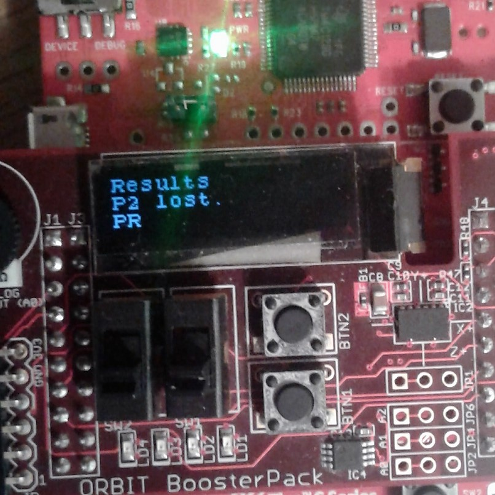
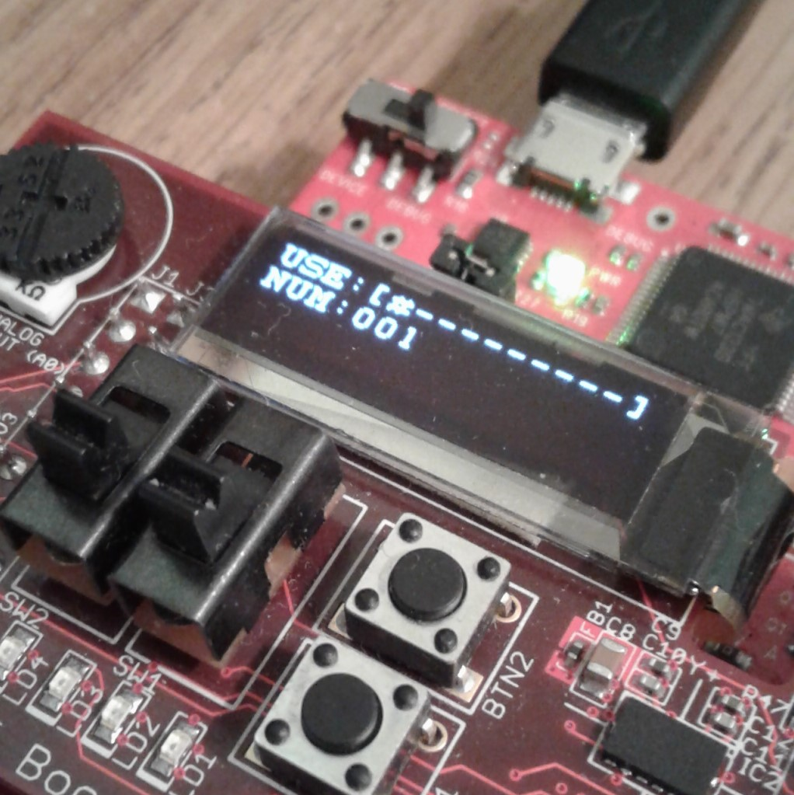

# Example Projects
This directory contains a suite of example projects. You are welcome to take a look at the code and learn from it.

## Rock-Paper-Scissors (Project\_RPS)

Mini-game emulating rock-paper-scissors. You should peek at Wire\_Util.ino. It might inspire some useful ways to abstract away I2C communication, making it simpler to work with the chips/EEPROM on the Orbit Booster pack!

Notes:
 - I recommend mimicking the structure found in [Wire Utilities](Project_RPS/Wire_Util.ino). You often need to read/write registers on I2C devices and the protocol follows the same pattern normally. You want to avoid filling your code with reads/writes to the I2C wire.
 - You might've noticed [this instantiated object](Project_RPS/Wire_Util.ino#L7). Yes, your code is compiled as C++ (not C) if you use `.ino` or `.cpp` so objects are allowed! Do not worry too much about this. Just have this instance somewhere in your code -- constructed with 0, to indicate a specific pin set -- and use it like the `Wire` object as described in the Energia reference.
 - [Shake Detection](Project_RPS/Shake_Detection.ino) is an example of reading the accelerometer. Read the accelerometer datasheet for more information on I2C communication.

Components Used:
 - Accelerometer for shake detection.
 - OLED Screen and button for user interface.

Implemented Features:
 - Basic paged user interface.
 - Hacked shake-detection using the magnitude of acceleration.
 - A [loading bar](Project_RPS/Game_UI.ino#L67) that I never ended up using. 
 - Between 2-4 Players, with results posted as whichever player loses.

TODO:
 - Ha. I do not implement ties. Woops :)

## File Storage Project (Project\_Storage)

This example project implements a simple flat-file storage system on the Tiva Board.

Notes:
 - See [File System Monitor](Project_Storage/File_System_Monitor.c) for simple example usage of the Orbit OLED library.
 - This application uses the *internal Tiva EEPROM* which is only 2KB in size. The Orbit Booster Pack contains an EEPROM that is 32KB in size but it *cannot* be accessed using the same API that I used here. You need to manually interact with the chip through I2C. This is no different than working with the accelerometer or thermometer. 

Components Used:
 - Device EEPROM, via the TivaWare DriverLib API.
 - Orbit Booster Pack OLED for Display.
 - Serial (UART) for receiving file operations.

Implemented Features:
 - Adding/Retrieving Files via Serial I/O.
 - Basic flat-file system functionality (Add/Remove/Read/Stat/Reset)
 - Use OLED Screen to show information about file system.

TODO:
 - (Maybe) use buttons to lock/unlock file system.
